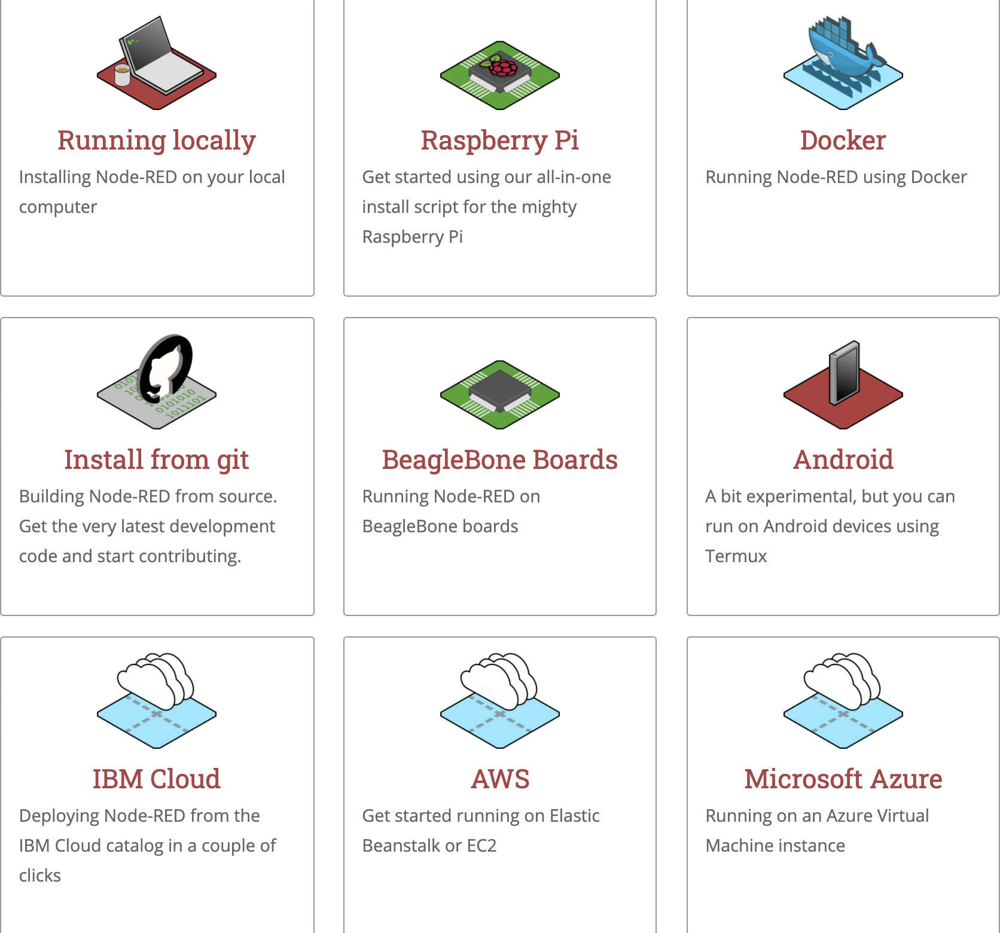
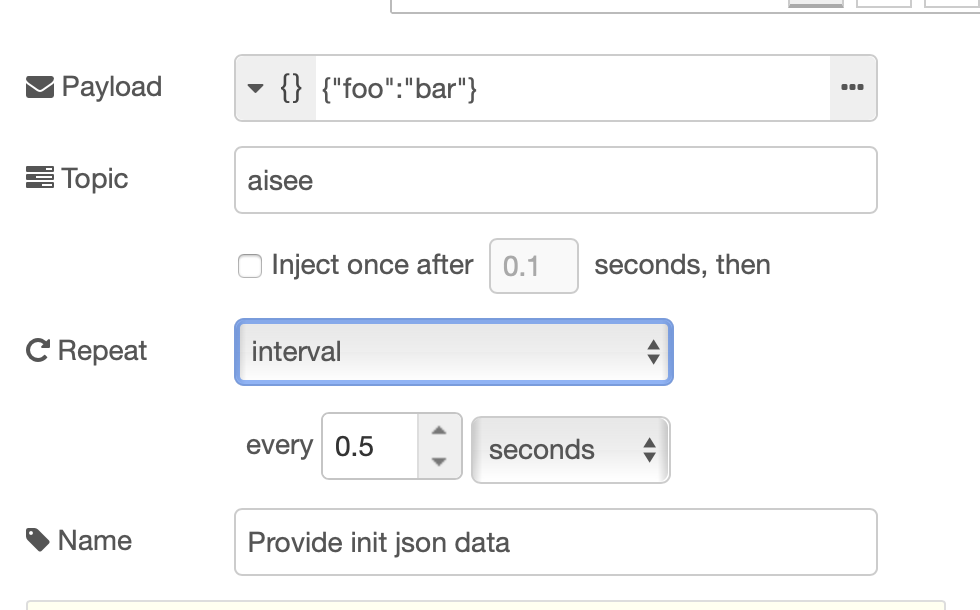
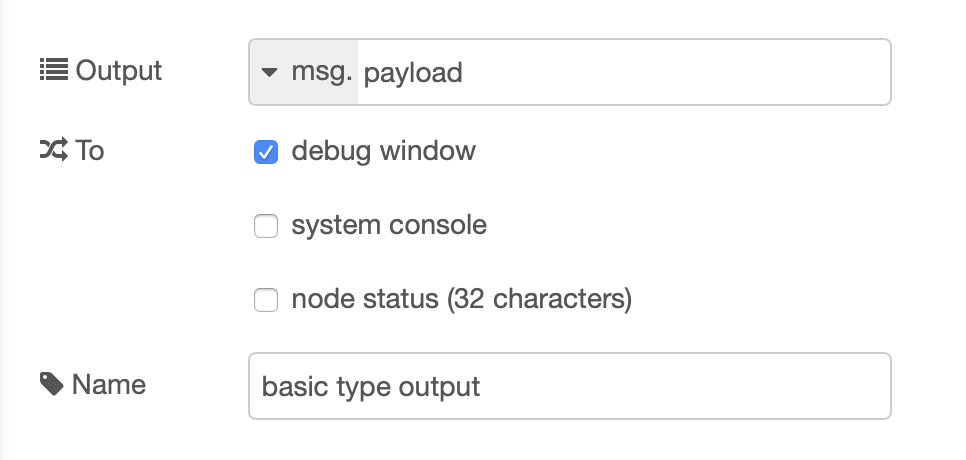
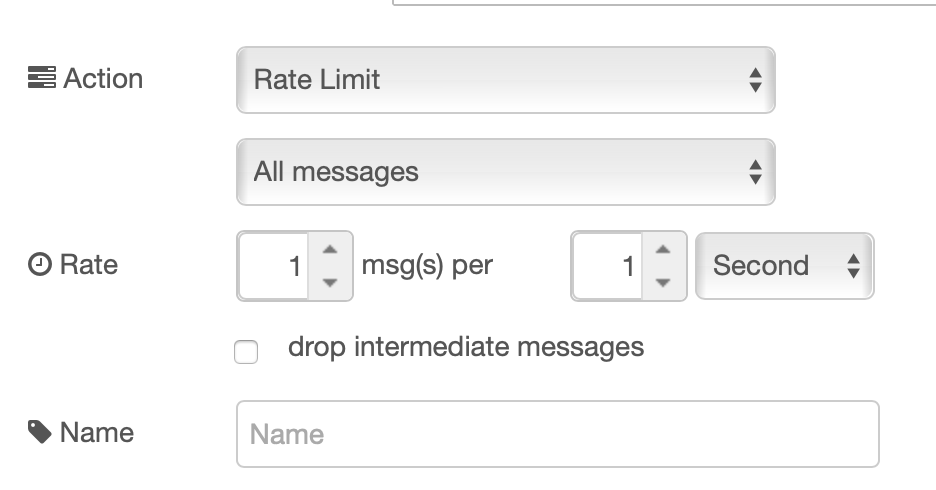
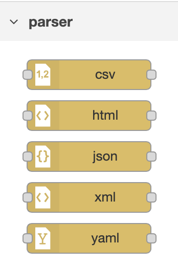
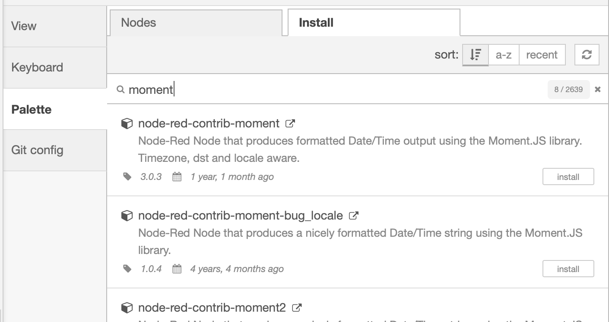

# Node-RED 构建可视化处理链

本文档基于 [官方手册](https://nodered.org/docs/user-guide/) 和个人实践总结。


## 索引

- [Nodinx 的中台职能](./docs/nodinx.md)
- 为何使用 Node-RED
- 能够解决的问题
- 获取和部署
- 项目结构
  - 配置
  - 版本控制
  - 权限管理
- 基础功能块
  - 输入
  - 调试
    - 定时任务
  - 函数输出通道
  - 延迟触发
  - 数据结构解析
- http 处理链
  - ctx 上下文
  - 环境变量注入
  - 错误处理
  - 日志
- 插件生态支持
  - 模块化支持
  - 自定义节点

## 为何使用 Node-RED

__Nodinx 看上去似乎完美的履行了作为中台服务的职能，为何还需要引入 Node-Red？__

事实上，Nodinx 的确拥有了服务功能，但是现实的业务场景却是...

1. AISee 经过团队的易手，打着重构名义作为历史坑遗留的代码并不少
2. 欠缺的测试用例，覆盖率根本不达标
3. 之前设计 Nodinx 作为接入层的团队没有中台概念，导致现在的中台和前端部署在同一个项目中，有耦合页面的逻辑在中台（首页渲染）
4. 作为接入层，很多逻辑仅仅是单纯调用了 Java Taf proxy 而已，没有校验，没有针对页面 Redux 的 view model 设计
5. 约定大于配置设计是很好，但是 Nodinx 重度依赖的插件生态，维护的团队已经不在，没有接手的 BG 内维护人员，导致遇到问题只能阅读插件源码
6. 接入层 API 成为独立的服务部署，但是业务重合度在 9 成以上，每次开发了 Web 页面的中台要更新对应的接口服务
7. 作为中台业务边界模糊，很多逻辑渗透到前端页面和后端 Java，没有履行技术角色的定位

除了上述场景之外，还有一些独立的服务场景，譬如

1. TAPD 转单
2. 合作业务穿山甲等独立业务逻辑
3. 自动回复逻辑
4. 企业微信客服号

......

现实均由后端承担，使得本该着重于 DB 优化、操作系统负载问题、流量监控、服务架构优化的后端同学难以脱身，很多时间不得不同时扮演技术支持 + 业务开发的角色

那么 Node-RED 成为承担与核心业务拥有清晰的领域边界职能的业务中台角色便进入我们的视角。


## 能够解决的问题

Node-RED 能够解决的问题是使开发人员更容易针对处理链的输入输出进行维护。

其本身是基于 Express.js 构建的可视化处理流式 Node.js 服务框架，最初由 IBM 技术服务团队开发，目前已经成为了 [JS Foundation](https://openjsf.org/) 的一部分。

Node-RED 为明确的业务块和数据流划分节点，非常适合构建视觉表示的模型，开发人员无需运行节点的各个代码便可以查看关注的流程在履行的职能。


## 依赖获取和部署

Node-RED 支持在 [不同平台](https://nodered.org/docs/getting-started/) 部署



这里以容器化部署为例

简单命令行拉取镜像 + 运行

```
docker run -it -p 1880:1880 --name mynodered nodered/node-red
```

我们这里使用 docker-compose 的方式构建，将上述命令配置化

__docker-compose.yml__

```
version: '3'

services:
  mysql:
    image: nodered/node-red:latest
    container_name: mynodered
    ports:
      - "1880:1880"
    volumes:
      - ./data:/data
    restart: always
```

以上指定构建的镜像、部署的容器名、挂载的目录和端口等信息

然后直接部署

```
docker-componse up -d
```

这里简单起见，不用集群的方式部署，本地单跑一个节点为例做演示，实际场景如果需要部署集群 [参考官方文档](https://nodered.org/docs/getting-started/docker#docker-stack--docker-compose)


## 项目结构

部署成功后可以通过 `docker-componse logs` 观察后台日志，项目根目录下生成了对应的挂在文件夹，可以看到目录结构。

```
flows.json        jsconfig.json     node_modules      package.json      settings.js
flows_cred.json   lib               package-lock.json projects          yarn.lock
```

项目主要依赖对 `settings.js` 文件的配置进行依赖和环境的更改，除此之外再也无需关注任何内容，打开 `http://localhost:1880` 可以访问到 flow 的配置面板。

### 配置

[官方文档 - 配置](https://nodered.org/docs/user-guide/runtime/configuration)

Node-RED 可以修改 `settings.js` 文件更改全局配置行为。

### 版本控制

[官方文档 - 版本控制](https://nodered.org/docs/user-guide/projects/)

启用版本控制，可以针对 flow 以 json 维度进行版本管理。

### 权限管理

[官方文档 - 安全性](https://nodered.org/docs/user-guide/runtime/securing-node-red)

Node-RED 分别以登录编辑和接口调用进行细部权限管理。

## 基础功能块

以下 Node-RED 涉及的基础功能块均可以用代码实现，但是建议用可视化方式组装，会减少维护成本。

### 输入

- 数据类型和复杂结构

- 定时任务

  以 0.5s 输入为例，实际场景可以用初始化配置替代变量。
  
  

### 调试

  Node-RED 传递 msg 对象，debug 节点可以随时针对每个处理链的输出进行调试。
  

### 函数输出通道

针对 subflow、function 等基础功能块，可以通过控制不同逻辑分支输出的通道分派结果。


### 延迟触发

延迟触发功能节点可以延迟某条消息的处理，也可以实现节流功能。

以下节流功能会限制每秒通过 1 条消息，输入可以选择累积或是丢弃。



### 数据结构解析

Node-RED 提供针对不同原始数据结构类型的解析节点，如果有定制需求可以从插件生态自行填补。



### http 处理链

- ctx 上下文

  [官方文档 - 全局上下文变量](https://nodered.org/docs/user-guide/context)

- 环境变量注入

  [官方文档 - 环境变量](https://nodered.org/docs/user-guide/environment-variables)
  
  可以通过注入节点进行环境变量的处理，也可以通过配置注入全局的可见变量。
  
  ```
      functionGlobalContext: {
	    process: require('process'),
          env: process.env,
          os: require('os'),
	    _: require('lodash'),
      },
  ```

- 错误处理

- 日志处理

## 插件生态支持

### 模块化支持



### 自定义节点
